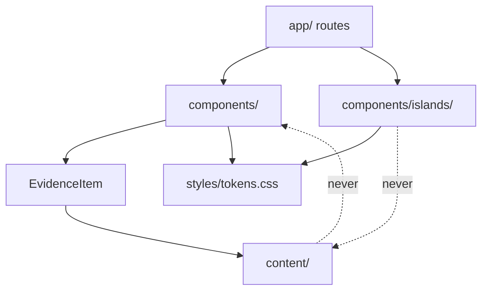

# Architecture Spine, ShahrouzPortfolio

## Design Paradigm

**Islands.** The page is server-rendered HTML. Interactivity exists only in explicitly named islands that hydrate independently.

Layered was considered and rejected: there is no domain logic, so a domain layer would be a heading rather than a constraint.

| Layer | Lives in |
| --- | --- |
| Sea, server-rendered | `app/`, `components/` |
| Content | `content/` |
| Islands, client | `components/islands/` |
| Tokens and global CSS | `styles/` |

There are exactly two islands: `RevealOnScroll` (AD-1) and `SectionRail` (AD-19).

## Invariants and Rules

### AD-1: Server by default, client only at a named island [ADOPTED]

- **Binds:** all
- **Prevents:** `"use client"` spreading as a convenience until the site ships JavaScript it does not need.
- **Rule:** Every Client Component lives in `components/islands/`, is listed in this spine, and must degrade to usable content when JavaScript is absent. Adding an island requires a new AD.
- **The island register, and it is closed:** `RevealOnScroll` (AD-14) and `SectionRail` (AD-19). A third requires a new AD.
- **Exemption, and the only one:** a third-party client component that is configuration rather than behaviour, carries no site logic, and renders no content. `<Analytics />` from `@vercel/analytics` is that component and lives in `app/layout.tsx`. No other exemption exists without a new AD.

### AD-2: The filter is not an island; the URL is the state

- **Binds:** FR-16 to FR-21, `/experience`, `/projects`
- **Prevents:** client-side filtering logic diverging from server-rendered results, and a filter island reappearing because a user interacts with it.
- **Rule:** Capability chips are `next/link` elements rendered from a Server Component. No `useState`, no context, no client-side filter, no hydration on either listing. Filter state is read from search params on the server and nowhere else.

### AD-3: The document title is the only announcement mechanism, and its format is fixed

- **Binds:** FR-20, FR-17, NFR-4
- **Prevents:** a bespoke live region or focus-gate being built to solve a problem the framework already solves; the two listings announcing in different shapes; and a filter change that announces nothing.
- **Rule:** One function in `lib/evidence.ts` produces every listing title. No route composes its own. The four states, and no others:

| State | Title, shown as it renders |
| --- | --- |
| Unfiltered | `Experience \| Shahrouz Mohaghegh` |
| One capability | `Experience, 2 of 3 case studies, Engineering Leadership \| Shahrouz Mohaghegh` |
| Several capabilities | `Experience, 3 of 3 case studies, Engineering Leadership or AI-Native Engineering \| Shahrouz Mohaghegh` |
| No matches | `Projects, no projects match, Executive and Stakeholder Influence \| Shahrouz Mohaghegh` |

  The listing noun is "case studies" on `/experience` and "projects" on `/projects`, singular when the count is one. Several capabilities join with **"or"**, in canonical order, never "and" and never a comma list. The filter is OR logic, so "and" would announce an intersection where the user selected a union. `EXPERIENCE.md` uses "or" for the same reason.

  Capability names are the full forms in canonical order, never the chip short forms. **Every distinct filter state must yield a distinct title**, because the route announcer fires only when the title changes; two states sharing a string announce nothing. Verified by unit test.

- **Note:** Next.js's route announcer uses `aria-live="assertive"` with `role="alert"` and reads `document.title` first. Confirmed in current source, 2026-09-30.


### AD-4: Search params, accepting dynamic rendering on the listings

- **Binds:** FR-17, `/experience`, `/projects`
- **Prevents:** half the site encoding filter state in the path and half in the query.
- **Rule:** One `capability` parameter, comma separated, four fixed slugs, canonical order matching chip order, omitted when empty, liberal on read and canonical on write. The two listings render dynamically. Every other route is statically generated.
- **Declared departure:** this is the deliberate exception to addendum section 4 and NFR-6, which ask for static generation wherever possible. These two routes fetch nothing and render local data, so the cost is a server render measured in microseconds. The alternative, sixteen statically generated pages behind an optional catch-all, was rejected for creating a duplicate-content problem requiring canonical tags.

### AD-5: Metadata in TypeScript, prose in MDX

- **Binds:** FR-1, FR-2, FR-8, FR-9, FR-13
- **Prevents:** content authored two ways, and an invalid Capability reaching the build because MDX exports are not type-checked.
- **Rule:** Structured metadata lives in `content/<collection>/index.ts` and is type-checked. Prose lives in `content/<collection>/<slug>.mdx`. Frontmatter is never the source of typed data.
- **Declared departure:** NFR-8 says one Evidence Item is added by editing one file. This forces two. Accepted, because MDX named exports are untyped (`@types/mdx`) and `@next/mdx` does not parse frontmatter at all by default, so the alternative trades FR-2's compile-time guarantee for a build-time one.
- **Turbopack note:** remark and rehype plugins must be named as strings, not imported.

### AD-6: `EvidenceItem` is the only contract between content and consumers

- **Binds:** FR-1, FR-8, FR-13, FR-16, FR-19
- **Prevents:** the two collections drifting apart, and a field added to case studies silently failing to appear for projects.
- **Rule:** Both collections satisfy a shared `EvidenceItem` interface: `slug`, `kind`, `title`, `summary`, `capabilities`, `headlineMetric`, `href`. The filter and every Card read only through `EvidenceItem`, never through the concrete `CaseStudy` or `Project` types.

### AD-7: Invalid metric states are unrepresentable

- **Binds:** FR-3, FR-34
- **Prevents:** a scoped figure such as the pilot metrics rendering without its qualifier because an author forgot.
- **Rule:** `type HeadlineMetric = { value: string; qualifier: string } | { value: string; qualifierNotRequired: true }`. Omission is not an available state. This is deliberately stronger than FR-3, which specifies an optional field and therefore does not achieve its own goal.

### AD-8: `tokens.css` is the source of truth for every design value

- **Binds:** NFR-7, all styling
- **Prevents:** a documented token and a coded token drifting apart silently, and the rule being read as a colour rule when 89 of the 109 tokens are not colours.
- **Rule:** Every design value is a CSS custom property in `styles/tokens.css`: colour, spacing, type size, line height, letter spacing, rule weight and radius. **No literal colour, length or font-size appears in any CSS Module.** Breakpoints are the single exception, since custom properties cannot be used in media queries; they are declared once as documented constants in `styles/breakpoints.css` and referenced nowhere else.
- **Enforcement:** an ESLint or Stylelint rule fails the build on a literal hex, `rgb()`, `px`, `rem` or `em` value inside `*.module.css`, with `tokens.css` and `breakpoints.css` exempt.
- **Also governed, and previously ungoverned:** `font-family`, `font-weight`, the `rounded` group and the `components` group. And the two value-SELECTION rules in `DESIGN.md`, which choose between tokens rather than declaring one: figure demotion by rendered character count, and focus-ring colour by the ground the ring lands on. Both are implemented once, in shared CSS, never re-derived per component.
- **Drift check scope:** `scripts/check-tokens.mts` asserts parity for the `colors`, `typography` and `spacing` token groups whose values are single CSS values. Composite entries such as `hero-plate-desktop: 480px x 372px` are documentation, not tokens, and are listed as exclusions in the script rather than silently skipped.


### AD-9: Content and link checks run against a running server

- **Binds:** FR-27, FR-29
- **Prevents:** a check that scans the wrong artifact, giving the comfort of a guard without the protection of one.
- **Rule:** CI runs `next build`, then `next start`, then crawls every route including every filter combination and scans the returned HTML.
- **The rule set is conditional, not a blocklist, and this is the whole difficulty.** Seven of the eighteen rules in FR-29 are not literal matches: some permit a term inside one exact phrase while failing it everywhere else, some fire only when a second term is absent from the same page, and others depend on proximity to a figure, on an inferred value, or on list context. **A naive blocklist fails CI on legitimate copy**, which is the exact defect found and fixed during the UX phase. Every rule is implemented with its exemption and its condition, and each ships with a unit test asserting both a true positive and the exemption it must not fire on.
- **Scope beyond the crawl:** the em dash rule and the "no raw hex" rule (AD-8) cannot be checked by crawling rendered HTML, because the PRD binds them in source, comments and commit messages too. They are enforced by lint over the repository and a commit-message hook, not by the crawl. Source files and build output are not the target, because FR-29 governs what a visitor sees and the two listings emit no HTML at build time. The same crawl satisfies FR-27's link integrity check.

### AD-10: Dependency direction

- **Binds:** all
- **Prevents:** content reaching for presentation concerns, and the island growing into a general client boundary.
- **Rule:** Content knows nothing about components. Components read content only through `EvidenceItem`. Routes compose components. Nothing imports upward. The island imports no content and no other island.



### AD-11: Wrapping is the accepted narrow failure mode

- **Binds:** NFR-1, primary nav
- **Prevents:** a builder reintroducing the disclosure menu the UX phase deliberately eliminated.
- **Rule:** At widths below 375px the nav may wrap to a second line. Horizontal scroll is never acceptable at any width. No disclosure menu at any breakpoint.

### AD-12: One image element per portrait

- **Binds:** FR-4, NFR-3
- **Prevents:** two `<Image>` elements shown and hidden by breakpoint, which downloads both and costs the LCP budget twice.
- **Rule:** Each portrait is one `next/image`. Desktop and mobile crops come from CSS changing `object-position` and the container aspect ratio. The hero carries `loading="eager"` and **not** `priority`. Sources are 1311x1200 and are never upscaled beyond natural size.
- **Revised 2026-10-07, why not `priority`:** at 375px the plate sits below the 550px fold (UX-DR48), so the mobile LCP element is the headline text, set in system fonts with no web font to wait for (`DESIGN.md`, zero web fonts). `priority` would add a high-priority preload for an off-screen image on the one profile NFR-3 bounds at 2.0 seconds. `loading="eager"` keeps the image in the initial fetch at normal priority, so the preload scanner finds it straight from the server HTML at 1440px, where it is likely the LCP element, and the plate is not blank when a phone scrolls to it. One element cannot carry a breakpoint-conditional `priority`, so the choice favours the profile with the hard limit.
- **Fallback, measured not guessed:** if Story 5.4 shows desktop Performance below 90 with LCP as the cause, add `fetchPriority="high"` to the hero (still not `priority`, so no preload link), then re-measure the mobile profile before accepting it.

### AD-13: One module owns evidence parsing, filtering and serialisation

- **Binds:** FR-16 to FR-21, AD-2, AD-4, AD-6
- **Prevents:** the largest divergence class in this spine. A shared interface is not a shared implementation: two stories can each satisfy `EvidenceItem` and still write their own param parser, disagreeing on casing, duplicates, an empty `?capability=`, and unknown slugs, so a selection fails to survive the FR-19 cross-route link.
- **Rule:** `lib/evidence.ts` is the sole owner of: parsing the `capability` param, normalising it to canonical order, serialising it back to a URL, the filter predicate, the cross-route counts, the listing title (AD-3), and the visible state-line string. The title and the state line share one joiner, so they can never disagree. No route, component or island reimplements any of these or reads `searchParams.capability` directly. Unknown slugs are dropped, duplicates collapsed, casing lowercased, and an empty parameter is equivalent to absent.

### AD-14: Reveal targets opt in through one global class

- **Binds:** AD-1, NFR-2, the `RevealOnScroll` island
- **Prevents:** one story wrapping bands in the island while another marks stages with a CSS Module class the island's selector can never match; and the far worse failure of an unscoped `opacity: 0` shipping content permanently invisible with JavaScript off.
- **Rule:** A section opts in by carrying the global class `reveal`. The hidden state applies only under `:root.js-reveal .reveal`, and `js-reveal` is added to the root element by script at runtime. It is never in static CSS. These two selectors live in `styles/reveal.css`, which is global and exempt from CSS Modules. `prefers-reduced-motion: reduce` skips the observer entirely rather than dropping the transition.

### AD-15: Content integrity is tested, not trusted

- **Binds:** FR-1, FR-2, FR-3, AD-5, AD-6
- **Prevents:** an `index.ts` entry with no MDX file rendering a detail page with no prose, and an orphan MDX file being silently absent from the site with no error anywhere.
- **Rule:** A Vitest suite asserts, in both directions, that every `index.ts` slug has a matching `.mdx` file and every `.mdx` file has a matching entry. It also asserts every Evidence Item carries at least one Capability and a well-formed `HeadlineMetric`. CI fails on any mismatch.

### AD-16: Metadata has one owner per route

- **Binds:** NFR-4, FR-9, FR-32, AD-3
- **Prevents:** six routes inventing their own metadata shapes, an ownerless sitemap, and the collision where AD-3's counted title silently becomes the SEO title on the two highest-value routes.
- **Rule:** Every route exports `metadata` or `generateMetadata`. Titles come from `lib/evidence.ts` for listings (AD-3) and from the Evidence Item for detail routes. Open Graph and Twitter Card metadata is set once in the root layout and overridden only where a route has its own image. `app/sitemap.ts` and `app/robots.ts` are the sole owners of their files. **Filtered listing URLs carry `robots: { index: false }`**, so the counted titles never compete with the canonical listing in search results. Person structured data is emitted once, in the root layout.

### AD-17: Deployment, environments and the CI gate

- **Binds:** FR-25 to FR-29, FR-37, NFR-3
- **Prevents:** the operational envelope being decided per commit, and the deterministic guards degrading into advisory checks.
- **Rule:** **The Node version is declared in the repository, not in a shell.** `.nvmrc` pins 24 and `package.json` `engines` states the same, so local and Vercel cannot drift. This matters more here than on most projects: AD-9, AD-17 and AD-20 all treat CI as the source of truth, and a local-versus-remote runtime mismatch is the "works on my machine" failure those gates exist to eliminate. A newer Node installed locally is not used for this project.

  Two environments only: preview per pull request, production on the default branch. Apex and `www` both resolve with one redirecting to the other; HTTPS enforced; no `vercel.app` URL is ever published. V1 requires no environment variables, because there is no backend, database or external service. The CI pipeline runs in this order: lint, type check, unit tests, `next build`, `next start` plus the crawl (AD-9), the end-to-end and accessibility checks (AD-18, AD-20), the token drift check (AD-8).
  **A step gates deployment once it exists.** The delivery sequence deliberately deploys a placeholder at hour four, before any test exists; a gate cannot block a step that has not been written yet. Steps are added to the gate as they land, and the pipeline is complete before the first content deploy. **Rollback is a Vercel instant rollback to the previous production deployment**, not a revert commit, because the build is reproducible and the content is static. FR-37's uptime check is an external scheduled check against the production URL, owned by CI configuration, not by any application code.

### AD-18: Testing scope is fixed, not discretionary

- **Binds:** FR-27, and the budget
- **Prevents:** test scope expanding into the fastest available way to overrun a budget that already does not close.
- **Rule:** Vitest covers filter logic (AD-13), content integrity (AD-15) and title generation (AD-3). **Exactly one Playwright test exists**, the UJ-1 skim at 375px, and it exists only because "above the fold" requires a real viewport. The FR-29 and FR-27 crawl is plain Node `fetch` against `next start` and never runs in Playwright. Adding a second Playwright test requires a new AD. **The accessibility and performance gates in AD-20 are not covered by this cap**, because they are audits over a running site rather than behavioural tests, and NFR-2 and NFR-3 are named in the PRD as gates never to descope.

### AD-19: `SectionRail` is the second island

- **Binds:** FR-9, FR-13, `EXPERIENCE.md` Component Patterns
- **Prevents:** the section rail being built as a server component and silently failing its `aria-current` requirement, or a third island appearing because the register was never closed.
- **Rule:** The sticky section rail is a Client Component in `components/islands/`. It tracks the current section with an IntersectionObserver and sets `aria-current="true"` on exactly one rail link. With JavaScript absent it renders as a plain in-page anchor list, which is a usable table of contents, so the page never loses navigation. It owns the rail group headers and the continuous counter on `/projects/[slug]`.

### AD-20: Accessibility and performance are gates, not intentions

- **Binds:** NFR-1, NFR-2, NFR-3, `EXPERIENCE.md` Accessibility Floor
- **Prevents:** WCAG 2.1 AA being claimed in a contract and verified by nobody, which is how an accessibility commitment becomes decoration.
- **Rule:** CI runs an automated accessibility audit (axe) and a Lighthouse run against the production build, failing below 90 on any of the four categories and on any axe violation at serious or critical. The landmark structure (`header`, `nav aria-label="Primary"`, `main`, `footer` on every route) is asserted by the crawl. **One manual keyboard and screen-reader pass is owned by Shahrouz before launch**, because no automated tool catches what the UX gate found: an inert `aria-pressed`, a focus ring at 1.98:1, or a reflow that strips table roles.

### AD-21: The repository is a deliverable

- **Binds:** FR-28, section 8.4 of the brief addendum
- **Prevents:** the repository being treated as a by-product when UJ-3 is a Principal Engineer opening it, and the site's own PR-2 case study is about how it was built.
- **Rule:** The default branch carries a README explaining what the project is, how to run it and how it is structured, and an architecture document derived from this spine. CI fails on a secret in the tree, and on abandoned-work comment markers on the default branch. The lint rule enumerates them; this document does not, so that a spine lint does not fire on its own rule. Every dependency is justified in one line in the README, per NFR-7; a dependency added without one fails review. **Shahrouz must be able to explain any part of the implementation**, which bounds what agents may produce: a pattern he cannot explain is a defect regardless of whether it works.

### AD-22: The decision table does not use `display: block`

- **Binds:** FR-36, `EXPERIENCE.md` Production Carry-forward
- **Prevents:** a builder following the carry-forward note's primary instruction and spending 1.5 hours of role authoring plus a screen-reader pass that the budget no longer contains.
- **Rule:** At 375px the decision table stays a table. The three gate columns are hidden with `display: none` on those `th` and `td` only, leaving candidate source and outcome. Nothing changes `display` on the table, its row groups or its rows, so no implicit role is stripped and no ARIA role needs authoring. The three gate verdicts survive in the rendered text alternative beneath the table, which is required, not optional. The remaining Production Carry-forward notes bind the component author, except the sprite decision, which is a layout-level call owned by `app/layout.tsx`.

### AD-23: Not found is per route, not global

- **Binds:** FR-9, FR-13, `EXPERIENCE.md` Not Found
- **Prevents:** one root `not-found.tsx` emitting a single message where the contract requires two.
- **Rule:** `app/experience/[slug]/not-found.tsx` and `app/projects/[slug]/not-found.tsx` each render the shared component with their own message. Both call `notFound()` from the route segment so the status is a real 404.
- **Note (Story 2.2, decided by Shahrouz 2026-10-10):** an unmatched URL outside those segments gets `app/not-found.tsx`, a catch-all only: the route frame with no current nav item, an `h1` "Page not found" and a real 404. The per-slug pages keep their own messages.

### AD-24: TypeScript throughout, including tooling

- **Binds:** NFR-5, AD-21
- **Prevents:** repository scripts written in untyped JavaScript while the PRD requires TypeScript throughout, and a TypeScript runner added as a dependency only to execute them.
- **Rule:** Every script under `scripts/` is a `.mts` file, and its tests are `.test.mts`, run with `node --test`. Node 24 runs them directly by stripping types, so no `tsx`, `ts-node` or build step is added. `tsconfig.json` sets `erasableSyntaxOnly` so only syntax Node can strip is allowed (no `enum`, `namespace` or parameter properties), and `allowImportingTsExtensions` so scripts import each other by their `.mts` name. `npm run typecheck` covers the scripts under `strict`, and `any` is not used.
- **Exception:** a configuration file whose tool cannot load TypeScript without an extra dependency stays JavaScript. Today that is `eslint.config.mjs`, since ESLint needs `jiti` to read a TypeScript config. `next.config.ts` is already TypeScript.
- **Added 2026-10-08** at Shahrouz's request, after Stories 1.1 and 1.2 shipped their scripts as `.mjs` following this spine's own file tree.

## Consistency Conventions

| Concern | Convention |
| --- | --- |
| Naming | Files kebab-case. Types and components PascalCase. Slugs kebab-case and stable, since they are public URLs. |
| Capability slugs | `leadership`, `ai-native`, `executive-influence`, `hands-on`. Fixed, and the canonical order in every chip row and URL. |
| Content ids | `slug` is the identity of an Evidence Item everywhere: the MDX filename, the `index.ts` entry, and the route segment. |
| Errors | `notFound()` from the route segment so the status is a real 404, never a 200 rendering an error. |
| Styling | `styles/tokens.css` global, CSS Modules per component. No CSS-in-JS runtime, no framework, no component library. |
| Motion | IntersectionObserver plus CSS opacity and transform only. Hidden state applied by script at runtime, never in static CSS. `prefers-reduced-motion: reduce` skips the observer entirely. |
| Prose | No em dashes, in code, comments, commit messages or copy. |

## Stack

| Name | Version |
| --- | --- |
| Next.js | >=16.3.8 |
| React | 19.2 |
| Node | 24 |
| TypeScript | ^5, `strict` |
| @next/mdx | tracks Next.js |
| Vitest | ^5 |
| Playwright | ^1.63 |
| @vercel/analytics | ^2 |

Verified 2026-10-07. **16.3.8 shipped on 2026-09-30** and is the pin. It patches seven vulnerabilities (one high, five medium, one low), two of which bear on this architecture directly: cache poisoning of statically generated and incrementally regenerated pages, and information disclosure through App Router metadata image routes. An earlier draft of this spine pinned 16.3.7 on a misread schedule; 16.3.7 was a bug fix carrying none of the security fixes.

Node 24, and the bound is Vercel's, not a preference. Verified 2026-10-07: Vercel offers **24.x (default), 22.x and 20.x** for builds and functions. Node 26 exists on Vercel only in Sandboxes, a separate ephemeral-compute product, so **24 is the newest runtime this site can actually deploy on**. Node 20 is excluded separately: it reached end of life on 2026-04-30 and Vercel stopped accepting new Node 20 deployments from 2026-10-01. Vitest 5 independently requires Node 22.12 or higher.

TypeScript bounded to `^5`: `typescript@latest` is 7.0.2 and TypeScript 7 crashes `next build` with a SIGSEGV unless `experimental.useTypeScriptCli` is set.

## Structural Seed

```text
app/
  layout.tsx            root layout, analytics, route announcer is built in
  page.tsx              /
  experience/
    page.tsx            listing, dynamic, reads searchParams
    [slug]/page.tsx     case study detail, static
    [slug]/not-found.tsx  AD-23, its own message
  projects/
    page.tsx            listing, dynamic, reads searchParams
    [slug]/page.tsx     project detail, static
    [slug]/not-found.tsx  AD-23, its own message
  contact/page.tsx
  sitemap.ts            AD-16
  robots.ts             AD-16
components/
  islands/
    reveal-on-scroll.tsx   AD-14
    section-rail.tsx       AD-19
                           these two are the closed register, AD-1
content/
  case-studies/
    index.ts            typed metadata, the source of truth for FR-1 and FR-2
    *.mdx               prose, embeds the sequence and decision-table components
  projects/
    index.ts
    *.mdx
lib/
  evidence.ts           EvidenceItem, the filter predicate, canonical param parsing
styles/
  tokens.css            every design value, AD-8
  breakpoints.css       the one exception, AD-8
  reveal.css            global, exempt from CSS Modules, AD-14
scripts/
  check-repo.mts        publish allow-list and confidential terms, AD-24
  check-content.mts     crawl, FR-29 confidentiality and FR-27 link integrity
  check-tokens.mts      DESIGN.md to tokens.css drift check
```

## Capability to Architecture Map

| Feature or FR | Lives in | Governed by |
| --- | --- | --- |
| Content model, FR-1 to FR-3 | `content/`, `lib/evidence.ts` | AD-5, AD-6, AD-7 |
| Home, FR-4 to FR-7 | `app/page.tsx` | AD-1, AD-12 |
| Case studies, FR-8 to FR-12 | `app/experience/` | AD-5, AD-6 |
| Projects, FR-13 to FR-15, FR-35 | `app/projects/` | AD-5, AD-6 |
| Capability filter, FR-16 to FR-21 | `app/*/page.tsx`, `lib/evidence.ts` | AD-2, AD-3, AD-4 |
| Contact, FR-22 to FR-24 | `app/contact/page.tsx` | AD-1 |
| Deployment and CI, FR-25 to FR-29 | `.github/`, `scripts/` | AD-8, AD-9 |
| Analytics, FR-30, FR-31 | `app/layout.tsx` | AD-1 exemption |
| Uptime and deploy health, FR-37 | CI configuration, external check | AD-17 |
| SEO and metadata, NFR-4 | `app/*/metadata`, `app/sitemap.ts`, `app/robots.ts` | AD-16 |
| Testing, FR-27 | `*.test.ts`, `e2e/` | AD-18 |
| Diagram system, FR-36 | `components/`, embedded in MDX | AD-5 |
| Scroll reveal | `components/islands/` | AD-1, AD-14 |
| Section rail | `components/islands/` | AD-19 |
| Accessibility and performance gates, NFR-2, NFR-3 | CI | AD-20 |
| Repository quality, FR-28 | README, `docs/` | AD-21 |
| Decision table, FR-36 | `components/`, embedded in MDX | AD-22 |
| Not found | `app/*/[slug]/not-found.tsx` | AD-23 |

## Deferred

- **MDX frontmatter with build-time validation.** Revisit past roughly twenty Evidence Items, when editing two files per item becomes the larger cost than losing compile-time typing.
- **Static path segments for filter state.** Revisit only if the listings' dynamic rendering ever shows up in a real measurement. It trades microseconds for a duplicate-content problem across sixteen near-identical pages.
- **Google sign-in.** Fast-follow, and its purpose is currently open. It would introduce this project's first environment secrets.
- **Print styles for the listings.** V1 covers detail pages only.
- **Partial Prerendering.** Would make the listings static-shelled. Not worth adopting a newer rendering mode on a six-route site.
- **Not-found suggestions and search.** Out of scope; the not-found state offers three routes out and guesses nothing.

## Open Questions

1. **Resolved 2026-10-07: the "sixteen pre-rendered routes per listing" claim is corrected.** The technical finding stands exactly as written: accepting `searchParams` makes a route ineligible for static generation, `generateStaticParams` does not override it, and there are two routes per listing, both dynamic. **One correction to this question's own wording: the claim was never in the PRD.** FR-17 and FR-21 are rendering-agnostic. It lived in `EXPERIENCE.md` rule 7, in a smaller form in rule 3 ("one static route"), in the document's overview and platform lines, and in `.memlog.md` entry 53. All four `EXPERIENCE.md` instances are fixed and the memlog carries a correction entry. What the PRD did carry was NFR-6 stated flatly, which AD-4 had to declare a departure from; NFR-6 now carries the exemption naming both listings, so AD-4 is a conformance rather than a departure and needs no change.
2. **Resolved 2026-10-07: FR-5 versus the rendered fold.** Routed to John and FR-5 is amended to the UJ-1 set: four markers above the fold at 375px, of which the 38-person span and the governance seat may remain in the positioning prose and the bug reopen rate and cloud Secure Score must render as figures. The Azure estate figure moved below the fold, and was then removed from the site entirely by Shahrouz's decision later the same day (`sprint-change-proposal-2026-10-07-b.md`); FR-29 now fails the build on it. `EXPERIENCE.md` fold discipline, the 375px row, Flow 1 and the evidence band count are updated; the Home evidence bands drop from three to two because the Scale band restated the positioning paragraph. **AD-18 is unaffected in substance:** the Playwright count stays at exactly one, but that one test's assertion is strengthened by amended FR-27 to check position rather than DOM presence, and to name all six above-fold elements. The residual visual decision, `EXPERIENCE.md` Open item 21, is resolved: `{components.figure-pair}` above a defined 375 x 550 fold, with the portrait plate below it. That moved the LCP element at 375px, so AD-12 was revised to drop `priority` (see AD-12).
3. **Resolved 2026-10-07 by Shahrouz: `_bmad-output` ships in part.** No longer blocks delivery item 1. **Ships:** `briefs/brief.md`, `ux-designs/DESIGN.md`, `ux-designs/EXPERIENCE.md`, `architecture/ARCHITECTURE-SPINE.md`, `architecture/C4-ARCHITECTURE.md`. **Excluded:** `briefs/addendum.md` and `prds/prd.md`, because both enumerate the confidentiality terms they exist to suppress; `epics.md`, for its budget and descope reasoning; every `reviews/`, `reconcile-*` and `review-*` file; every `.memlog.md`; the sprint change proposals; and the whole of `docs/`. The trade named in the original question holds: the shipped subset shows the delivery model, and the excluded files carry the deliberation. Enforced from the first commit by Story 1.1. **Consequence for AD-21:** Story 1.3's secret and forbidden-term scan over the committed tree must cover the shipped planning files too, since they are now public.
4. **The budget does not close. Recomputed 2026-10-07: about 35.0 hours against 30, roughly five hours over, not three.** The recompute lives in `epics.md`, Budget, recomputed, and counts both what this phase removed and what the reviewer gate added (AD-20's audit steps, AD-21's README and architecture document, AD-9's per-rule tests, AD-8's drift check, AD-15's integrity suite, AD-3's title test). The PRD section 11 descope ladder does not close it: dropping PR-3 reaches about 33.0 and dropping to two Case Studies about 31.0. The options are a third week or a cut deeper than the ladder. **Still Shahrouz's call, and still open.** Architecture's part is done: no AD adds cost beyond what the recompute already counts.
