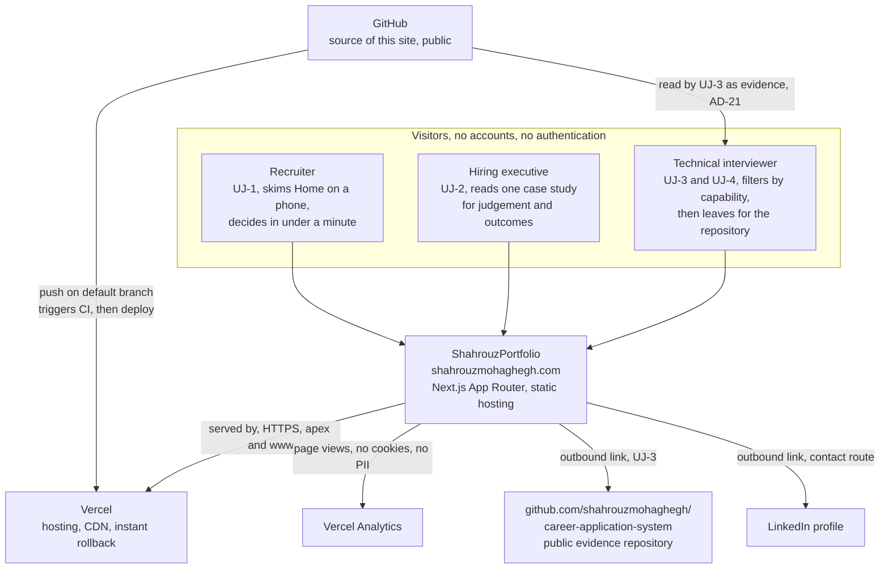
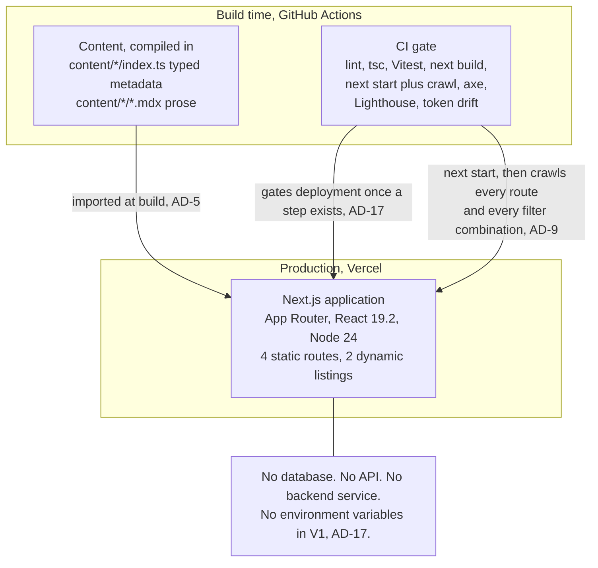
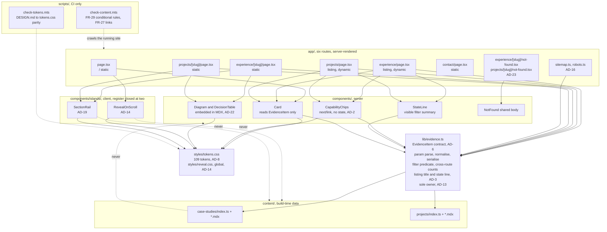

# C4 Architecture, ShahrouzPortfolio

Three levels, because only three earn their place. This is a six-route static
website with no backend, no database and no external service. The context and
container levels are therefore short by necessity, and the component level
carries the architecture.

Authority for every statement here is `ARCHITECTURE-SPINE.md`. Where this
document and the spine differ, the spine is correct.

---

## Level 1, Context

Governed by AD-17 (deployment and environments), AD-21 (the repository is a
deliverable), AD-1 (the Analytics exemption) and FR-30 and FR-31.

Three visitor types, taken from the PRD's user journeys. They are not roles in
the system: there are no accounts and no authentication. They differ only in
which route they enter on and how long they stay.

Two things in this diagram are load-bearing and easy to miss.

The GitHub repository appears twice for two different reasons. It is the build
input, and it is also a visitor-facing artifact: AD-21 makes the repository a
deliverable because UJ-3 is a Principal Engineer opening it, and because the
site's own PR-2 case study is about how it was built. A repository that looks
abandoned inverts UJ-3 into active damage, which is why FR-27's link integrity
check is launch-blocking.

Vercel Analytics is the only runtime dependency the browser reaches for, and it
exists under the single narrow exemption in AD-1: a third-party configuration
component that carries no site logic and renders no content.

---

## Level 2, Container

Governed by AD-4 (dynamic rendering on the listings), AD-5 (content format),
AD-9 (the crawl against a running server), AD-17 (the CI gate) and AD-20
(accessibility and performance gates).

There is essentially one container. Being honest about that is the point of
drawing this level at all.

The two listing routes render per request, which is the one declared departure
at this level. Accepting `searchParams` makes a route ineligible for static
generation, and that is a binary switch rather than a cost proportional to use.
AD-4 accepts it because these routes fetch nothing and render local typed data,
so the server render is measured in microseconds. The rejected alternative,
sixteen statically generated pages behind an optional catch-all, would have been
genuinely static at the cost of a duplicate-content problem across sixteen
near-identical pages requiring canonical tags.

The CI gate deserves its box rather than a footnote. AD-9 puts the
confidentiality and link checks against a running production server, not against
source files and not against build output. Source scanning throws false
positives on the rule list itself, and build output does not contain the two
listings at all, because by decision they emit no HTML at build time. A check
that scans the wrong artifact gives the comfort of a guard without the
protection of one.

---

## Level 3, Component

Governed by AD-1 (the closed island register), AD-2 (the filter is not an
island), AD-3 (title generation), AD-6 (`EvidenceItem`), AD-8 (tokens),
AD-10 (dependency direction), AD-13 (`lib/evidence.ts` ownership),
AD-14 (`RevealOnScroll`), AD-19 (`SectionRail`), AD-22 (the decision table) and
AD-23 (per-route not found).

The two dotted `never` edges are AD-10 stated as prohibitions rather than as
structure. Content knows nothing about components, and an island imports no
content and no other island. Both exist to stop a specific drift: content
reaching for presentation concerns, and an island quietly becoming a general
client boundary that everything else routes through.

The single most important node is `lib/evidence.ts`. The adversarial review of
this spine found twenty-one ways two independently built stories could produce
incompatible code from the same document, and fifteen of them traced to one
root cause: a shared interface is not a shared implementation. Two stories can
both satisfy `EvidenceItem` and still write their own param parser, disagreeing
on casing, duplicates, an empty `?capability=` and unknown slugs, at which point
a selection fails to survive the cross-route link in FR-19 and UJ-4 breaks.
AD-13 answers that by naming one owner for the whole behaviour, parsing through
serialisation through counting through title generation, with the title and the
visible state line sharing one joiner so they can never disagree.

Note what is absent from the island layer. The capability filter is the most
interactive thing on the site and it is not a client component. It was
originally classified as interactive because a user interacts with it, which
does not follow: interaction does not imply client-side state. The URL is the
state, the chips are `next/link` elements rendered on the server, and both
listings ship no hydration at all.

---

## Where this document chose

Two places where the spine is internally inconsistent, resolved in favour of the
ADs because the ADs are the normative sections.

1. **Island count in the Structural Seed.** The seed annotates
   `components/islands/reveal-on-scroll.tsx` as "the only client component",
   which predates AD-19. AD-1 and AD-19 both state the register holds two.
   Diagrams here show two.
2. **Not-found location in the Structural Seed.** The seed lists a single
   `app/not-found.tsx` serving both dynamic routes. AD-23 replaces it with one
   per route, because one file cannot emit the two messages the contract
   requires. Diagrams here follow AD-23.
